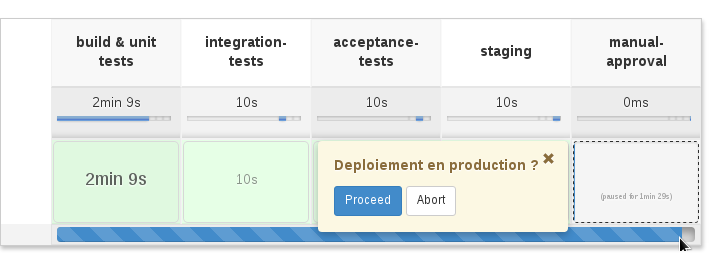

# Atelier Jenkins Pipeline 

Pré-requis :

* Git installé sur sa machine
* Connaissance de base sur Git
* Avoir un compte GitHub 

## Workshop #1 - Jenkins Pipeline basics

Objectifs : jouer avec les fonctionnalités offertes par Jenkins Pipeline.

### HelloWorldeuCon'

* Se connecter à votre Jenkins master avec les identifiants fournis.

* Créer un nouveau job de type Pipeline en lui donnant le nom qui vous fait plaisir

> Si vous n'avez pas encore eu l'occasion de voir les nouveautés de Jenkins 2, vous remarquerez que la configuration des jobs est maintenant accessible sous forme d'onglet beaucoup plus pratique qu'auparavant.

* Dans la partie Pipeline, cliquez sur le lien `Pipeline Syntax`. 

Sur cette page, vous verrez l'ensemble des outils vous permettant de vous aider à construire votre pipeline. 

Aller dans la partie `Snippet Generator`. Cet outil vous aidera à générer automatiquement des portions de DSL à partir des catégories choisies.
Sur les autres menus, vous pourrez trouver la documentation associée à Pipeline.

Cela vous servira de documentation de référence pour la suite du workshop.

> Le menu IntelliJ IDEA GDSL correspond à un script [GDSL](http://www.tothenew.com/blog/gdsl-awesomeness-introduction-to-gdsl-in-intellij-idea/) pour vous permettre d'avoir de l'autocompletion et de la verification de syntaxe basique lorsque vous codez du Pipeline Jenkins dans IntelliJ IDEA. Plutôt sympa, même si cela est encore perfectible à l'heure actuelle ! 

*  Revenez ensuite dans la configuration de votre pipeline, puis dans la partie `Definition`, cliquer sur "Try sample Pipeline ..." et sélectionnez `GitHub + Maven`.

* Lancer votre job.

Le projet sera récupéré, construit, testé puis archivé au niveau de Jenkins.
Sur la page du job, vous verrez une visualisation de votre pipeline via le plugin [Pipeline Stage View Plugin](https://wiki.jenkins-ci.org/display/JENKINS/Pipeline+Stage+View+Plugin). 

Votre job est jaune ou rouge ? Vérifier les logs mais cela peut être tout à fait normal. Le build Maven du repository Git retourne des résultats de tests unitaires aléatoires afin de permettre de visualiser les différents états possibles.
Relancer le plusieurs fois à la suite, vous devriez voir plusieurs résultats différents :-)

Félicitation ! vous avez lancé votre premier Pipeline Jenkins !

* Sur la page du build, relancer votre job en appuyant sur le bouton `Replay`

Jenkins vous affiche alors le script du pipeline utilisé durant le build. Faites une modification mineure dessus ("ajouter un `echo` par exemple) puis cliquez sur `Run`.
 
> Le bouton `Replay` est très pratique lorsqu'on est en mode développement de pipeline afin d'éviter de devoir systématiquement sauvegarder le script dans la configuration.

Une fois le build terminé, allez sur la page du build puis cliquer sur le lien "Replayed #X (`diff`)". Jenkins doit vous afficher les différences que vous avez apportées lors du `Replay`.

> Jenkins garde le script pipeline qui a été utilisé lors de chaque build.

### Création de l'ossature de notre pipeline

Le but de cette partie est de créer un pipeline "vide" (sans traitement réel, on veut juste jouer avec les capacités de Pipeline pour l'instant).

Il faut respecter les caractéristiques suivantes : 

* Le résultat final doit ressembler à ceci côté Blue Ocean :

* Entre la phase  `staging` et `deploy`, l'étape "manual-approval" permet de demander une action manuelle afin d'approuver le déploiement.
Ajouter un `input` permettant de valider ou non le déploiement.

* Les stages `build & unit tests`, `integration` et `acceptance-tests` doivent allouer un agent avec le label `build` et effectuer un `sleep` de 10s. 

* Le stage `acceptance-tests` doit paralléliser 3 traitements: `chrome`, `edge` et `firefox`, chacun effectuant un `sleep` de 10s.

* Les stages `staging` et `deploy` doivent allouer un agent avec le label `ssh` et effectuer un `sleep` de 10s.

> Votre master Jenkins est configuré pour créer un agent Jenkins à la demande dans le cloud [DigitalOcean](https://www.digitalocean.com/). Chaque noeud créé s'éteint automatiquement au bout de 120 minutes (temps du workshop).
> Le premier build sera donc plus long car le master créé et provisione de nouveaux noeuds dédiés au build s'il n'en possède pas pour les labels souhaités. 
Les prochains builds seront plus rapides, ne vous inquiétez pas :-)

> En attendant que vos agents soit provisionnés, vous pouvez aller tester la bêta de [BlueOcean](https://jenkins.io/projects/blueocean/) via le lien `Open Blue Ocean` au niveau de la banière de votre Jenkins.

---

> Cette partie est volontairement non détaillée. 
> Aidez-vous de la documentation intégrée via le lien `Pipeline Syntax` précédemment.
>
> Autre ressources pouvant vous aider :
> [Parallelism and Distributed Builds with Jenkins](https://www.cloudbees.com/blog/parallelism-and-distributed-builds-jenkins)
> [Using Agent](https://github.com/jenkinsci/pipeline-plugin/blob/master/TUTORIAL.md#using-agents)
> [Flyweight vs. Heavyweight Executors](https://github.com/jenkinsci/pipeline-plugin/blob/master/TUTORIAL.md#pausing-flyweight-vs-heavyweight-executors)

 
